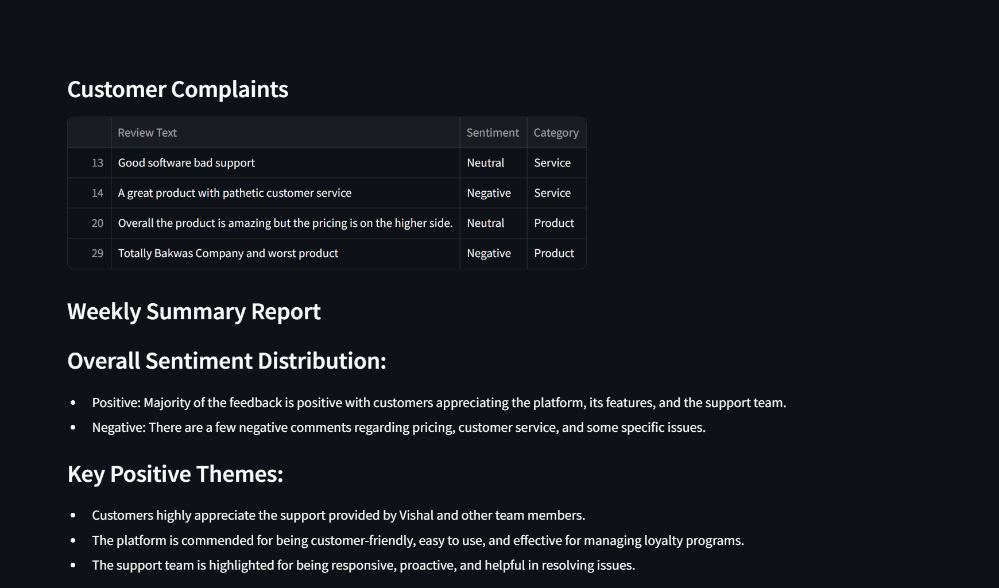
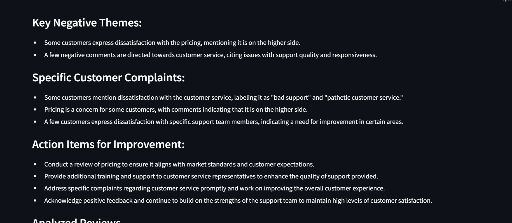
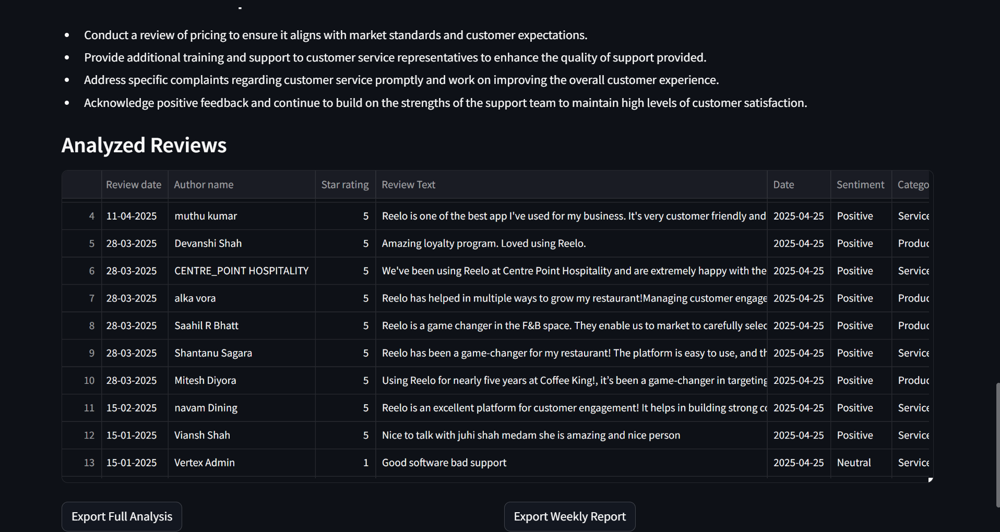
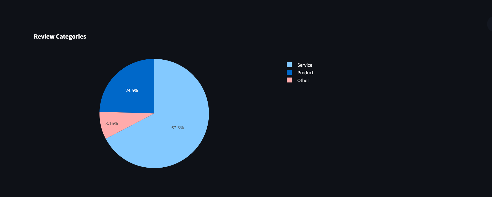

# Google Reviews Analyzer

A powerful Streamlit application for analyzing Google Reviews using OpenAI's GPT-3.5-turbo model. This tool provides sentiment analysis, review classification, complaint detection, and generates detailed weekly summaries.

## Application Screenshots

### Main Interface

*Upload your Google Reviews data file to begin analysis*

### Sentiment Analysis

*Interactive sentiment distribution chart showing the breakdown of positive, negative, and neutral reviews*

### Review Categories

*Visualization of review categories (Service, Location, Product, Other)*

### Detailed Analysis

*In-depth analysis of review patterns and trends*

### Weekly Summary

*Comprehensive weekly summary with key insights and action items*

### Export Options

*Download your analysis results in CSV or TXT format*

## Features

- 🔍 **Sentiment Analysis**: Automatically classify reviews as Positive, Negative, or Neutral
- 📊 **Review Classification**: Categorize reviews into Service, Location, Product, or Other
- ⚠️ **Complaint Detection**: Identify and flag customer complaints
- 📈 **Weekly Summary Reports**: Generate comprehensive weekly analysis reports
- 📊 **Interactive Visualizations**: View sentiment and category distributions
- 📥 **Data Export**: Export analysis results in CSV and TXT formats

## Prerequisites

- Python 3.8 or higher
- OpenAI API key
- Required Python packages (listed in requirements.txt)

## Installation

1. Clone the repository:
```bash
git clone https://github.com/sabhi728/Google-Review-Analyzer.git
cd Google-Review-Analyzer
```

2. Create and activate a virtual environment:
```bash
python -m venv venv
source venv/bin/activate  # On Windows: venv\Scripts\activate
```

3. Install required packages:
```bash
pip install -r requirements.txt
```

4. Create a `.env` file in the project root and add your OpenAI API key:
```
OPENAI_API_KEY=your_api_key_here
```

## Usage

1. Start the Streamlit application:
```bash
streamlit run app.py
```

2. Upload your Google Reviews data file (CSV or Excel format)
3. Click "Analyze Reviews" to process the data
4. View the analysis results, including:
   - Sentiment distribution charts
   - Review category breakdown
   - Customer complaints
   - Weekly summary report
5. Export the results using the provided download buttons

## Data Format

Your input file should contain at least the following columns:
- `Review Text`: The actual review content
- `Date`: (Optional) Review date

## Example Output

### Sentiment Analysis


### Review Categories


### Weekly Summary
The weekly summary provides:
- Overall sentiment distribution
- Key positive and negative themes
- Specific customer complaints
- Action items for improvement


---

Made with ❤️ using Streamlit and OpenAI 
